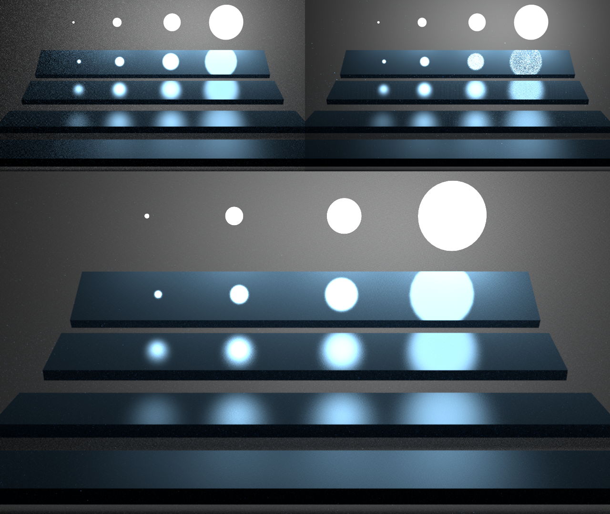
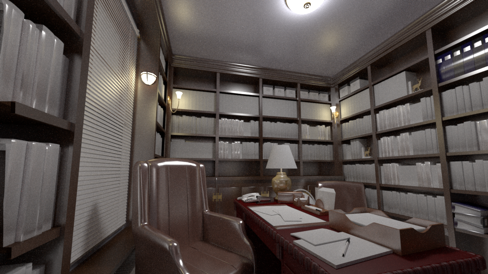

# Path Tracer

## 简介

### 环境配置

- Windows 10
- Visual Studio 2022
- C++17
- Cmake 3.28.1

### 编译

使用Cmake编译项目。

> 如果遇到OpenEXR第三方库中的Ilmlmf编译错误，则需要在`./ext/openexr/OpenEXR/IlmImf/ImfAttribute.cpp`文件第48行加入`\#include <functional>`

### 运行

```
./PathTracer.exe <scene_name> -t <thread_count> -s <samples_per_pixel> --no-gui --bdpt
```

说明：

- `<scene_name>`：选择渲染的场景，可选值为 `bathroom`, `cornell-box`, `library`, `veach-mis`，默认值为`cornell-box`（需保证`scenes`文件夹与可执行文件在同一目录下）。
- `-t` / `--thread` ：渲染使用的线程数，若缺省则自适应选择。
- `-s` / `--spp` ：每个像素的采样数，默认值为256。
- `--no-gui`：不启用GUI，默认启用。
- `--bdpt`：使用双向路径追踪，默认不使用（注意BDPT并没有实现正确，本项目给出的结果图均使用普通的MIS PT渲染得到）。

## 实现细节

### 系统框架

本系统整个场景的管理主要由`Scene`类实现，各类之间的关系见下图。其中，Shape实现了Triangle，Material实现了Phong材质，Light实现了diffuse面光源，Camera实现了透视相机（使用针孔相机模型），Accel实现了BVH加速结构，Filter实现了高斯滤波。另外，Integrator实现了MIS path tracer，尝试实现了BDPT，Sampler实现了随机采样和Sobol采样。


在程序运行后，首先渲染normal map和albedo map，然后进行路径追踪计算，我将整个视口分成了16x16像素的patch，每个path之间使用多线程并行渲染，渲染过程如下图。


### BVH加速结构

构建BVH树加速结构的算法流程如下：

1. 初始化：计算每个物体的AABB包围盒以及中心点，根据中心位置左边进行排序。
2. 从根节点开始从上至下构建BVH树，在具体实现中使用栈代替递归算法提高效率：
   1. 根节点入栈，根节点包围盒即整个场景的包围盒。
   2. 当栈不为空时，进入循环：
      1. 取出栈顶节点，当节点中物体数量小于阈值时，将此节点设为叶节点。
      2. 否则进行分割，找到代价最小的分割位置，并将分割后的子节点入栈。

分割节点的算法流程如下：

1. 计算节点不分割的SAH代价。
2. 从左至右计算部分SAH代价，再从右至左计算完整SAH代价，找到代价最小的分割点。再实际实现中，将此节点中包含的物体分成32个chunk粗略计算代价，如果完整遍历效率太低。
3. 根据分割位置将物体重新分组。

### Phong材质

Phong材质的BRDF计算公式为：
$$
f_{\mathrm{Phong}} (w_o, w_i) = k_d\frac{1}{\pi} + k_s \frac{n+2}{2\pi}\cos^n(\mathrm{reflect}(w_i), w_o)
$$
其中 $w_i, w_o$ 分别为入射方向和出射方向，$k_d, k_s$ 分别为diffuse reflectivity和specular reflectivity，$n$ 为shininess。Phong材质BRDF计算非常简单，根据公式很容易写出代码，但是Phong的BRDF重要性采样需要特殊考虑，因为Phong模型BRDF由diffuse和specular两个lobe组成，所以可以一定概率 $p_{\mathrm{diff}}$ 选择每次采样是根据diffuse lobe采样还是specular lobe采样，这个概率可以由 $k_d, k_s$ 能量大小的比例得到：
$$
p_{\mathrm{diff}} = \frac {k_d} {k_d + k_s}
$$
其中diffuse lobe的重要性采样是Cosine weighted半球采样：


伪代码如下：

```
x = sqrt(u[0])*cos(2*M_PI*u[1]);
y = sqrt(u[0])*sin(2*M_PI*u[1]);
z = sqrt(1-u[0]);
pdf = z / M_PI;
```

而specular lobe的重要性采样伪代码如下：


```
cosTheta = pow(1-u[0],1/(1+s));
sinTheta = sqrt(1-cosTheta*cosTheta);
phi = 2*M_PI*u[1];
x = cos(phi)*sinTheta;
y = sin(phi)*sinTheta;
z = cosTheta;
```

最终Phong的BRDF采样pdf为：
$$
pdf = p_{\mathrm{diff}} \cdot {pdf}_{\mathrm{diff}} + (1-p_{\mathrm{diff}}) \cdot pdf_{\mathrm{spec}}
$$

### 路径追踪

路径追踪的算法步骤如下：

1. 从相机采样一条光线。
2. 当光线与场景相交时，进入循环：
   1. 如果相交表面是光源，计算光源辐射的能量，添加到当前像素的能量中。
   2. 采样光源：
      1. 从场景中采样光源，从光源表面采样一点。
      2. 若光源采样点与当前表面之间没有遮挡，计算光源辐射的能量与表面的BRDF，添加到当前像素的能量中。
   3. 采样BRDF：
      1. 采样当前表面处的BRDF，更新累计的throughput。
      2. 根据采样方向产生下一根光线。
   4. 根据俄罗斯轮盘赌决定是否停止路径追踪

<div style="page-break-after:always;"></div>

## 实验结果

### 不同采样器对比

spp=128，左：Independent Sampler；右：Sobol Sampler


从上图中可以看到使用低差异序列Sobol采样器可以减少噪点，降低方差。

### 多重重要性采样

左：spp=512，BRDF重要性采样；右：spp=512，光源重要性采样；下：spp=128，BRDF+光源多重重要性采样



从左图中可以看出，由于只对BRDF采样，比较粗糙的glossy材质会难以采样到比较小的光源，所以导致图中左下角光斑噪点非常多。

从右图中可以看出，由于只对光源采样，在比较光滑的glossy材质表面采样面积较大光源时，大部分采样BRDF值都很小，所以导致图中右上角光斑噪点非常多。

从下图中可以看出，结合BRDF和光源两种分布的MIS采样，能够在上述两种情况下都保持较低的variance。

### 更多结果

Bathroom，spp=2048


<div style="page-break-after:always;"></div>

Library，spp=1024，from: https://blendswap.com/blend/19984



## 参考文献

1. Lafortune, Eric P. and Yves D. Willems. “Using the modified Phong reflectance model for physically based rendering.” (1994).
2. Shirley, P. *et al.* (2019). Sampling Transformations Zoo. In: Haines, E., Akenine-Möller, T. (eds) Ray Tracing Gems. Apress, Berkeley, CA.
3. Pharr M, Jakob W, Humphreys G. Physically based rendering: From theory to implementation[M]. MIT Press, 2023.
4. nori: [wjakob/nori: Nori: an educational ray tracer (github.com)](https://github.com/wjakob/nori)
5. bvh: [madmann91/bvh: A modern C++ BVH construction and traversal library (github.com)](https://github.com/madmann91/bvh)
6. SORT: [JiayinCao/SORT: Simple Open-source Ray Tracer (github.com)](https://github.com/JiayinCao/SORT)
